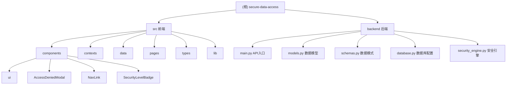

# secure-data-access 项目架构文档

## 项目愿景

secure-data-access 是一个基于强制访问控制（MAC）原理的安全数据访问系统，专注于实现安全标记访问控制系统（Security Label Access Control, SLAC）。该项目旨在通过实施严格的安全级别标记机制来保护不同敏感度级别的数据资源，并提供完整的审计追踪功能。其核心目标是：验证主体（用户）的安全标记与客体（数据）的安全标记是否匹配，从而实现对数据的强制访问控制。

## 架构总览

这是一个全栈安全数据访问系统，采用前后端分离架构：

**前端技术栈：**
- React + TypeScript + Vite + Tailwind CSS
- shadcn/ui + Radix UI 组件库
- React Router 路由管理

**后端技术栈：**
- FastAPI + Python 3.11
- SQLAlchemy ORM + MySQL 数据库
- Pydantic 数据验证
- Uvicorn ASGI 服务器

架构遵循分层设计原则：
- **前端 UI 层**：基于 shadcn/ui 的响应式用户界面
- **前端应用层**：React 组件、路由、状态管理（AuthContext）
- **后端 API 层**：FastAPI RESTful API 接口
- **后端业务层**：安全引擎、访问控制逻辑
- **数据层**：MySQL 数据库 + SQLAlchemy ORM

## 模块结构图



## 模块索引

### 前端模块
| 模块路径 | 职责描述 |
|---------|----------|
| src/contexts | 认证上下文管理，处理用户登录状态和权限 |
| src/pages | 主要页面组件（登录、管理员仪表盘、用户工作台） |
| src/components | 通用UI组件和安全相关组件 |
| src/types | 安全标记相关的类型定义 |
| src/data | Mock 数据定义 |
| src/lib | 工具函数 |

### 后端模块
| 模块路径 | 职责描述 |
|---------|----------|
| backend/main.py | FastAPI 应用入口，定义 RESTful API 接口 |
| backend/models.py | SQLAlchemy 数据模型定义 |
| backend/schemas.py | Pydantic 数据验证模式 |
| backend/database.py | 数据库连接配置和会话管理 |
| backend/security_engine.py | 基于 BLP 模型的安全访问控制引擎 |

## 运行与开发

### 环境要求
- Node.js 18+
- Python 3.11+
- MySQL 8.0+

### 后端启动
```bash
# 进入后端目录
cd backend

# 创建虚拟环境（首次）
python -m venv venv

# 激活虚拟环境
venv\Scripts\activate

# 安装依赖
pip install fastapi uvicorn sqlalchemy pymysql pydantic

# 启动后端服务
python main.py
# 服务地址：http://127.0.0.1:8001
```

### 前端启动
```bash
# 安装依赖
npm install

# 启动开发服务器
npm run dev
# 服务地址：http://localhost:5173
```

### 构建
```bash
# 构建生产版本
npm run build
```

### 代码检查
```bash
# 代码检查
npm run lint
```

### 预览构建结果
```bash
npm run preview
```

### 预设账户信息
- 管理员：admin / admin123 (安全等级：绝密)
- 公开用户：public_user / user123 (安全等级：公开)
- 绝密用户：secret_user / secret123 (安全等级：绝密)


## 编码规范

- 代码风格：遵循 ESLint 规范
- TypeScript：严格类型检查
- 组件命名：采用 PascalCase
- 样式命名：使用 Tailwind CSS 实用优先方法
- 文件组织：按功能模块划分目录结构

## AI 使用指引

### 数据库设计

### 安全等级表（sys_security_level）
- `level_id`：等级 ID（主键）
- `level_name`：等级名称
- `level_weight`：权重值（用于比较等级高低）
- `description`：等级描述

## API 接口

### 获取安全等级列表
- **接口**：`GET /security-levels`
- **功能**：返回所有安全等级信息
- **返回格式**：JSON 数组，包含等级 ID、名称、权重和描述

## 核心安全逻辑
- 安全等级：public < internal < confidential < secret < top-secret
- 访问规则：主体安全等级 ≥ 客体安全等级 时允许访问
- 访问控制：通过 `verify_access()` 函数实现（基于 BLP 模型）

### 前端关键组件
- `SecurityLevelBadge`：显示安全等级标记的徽章组件
- `AccessDeniedModal`：当访问被拒绝时显示的模态框
- `AuthContext`：管理用户认证状态和权限验证

### 后端关键模块
- `verify_access()`：基于 BLP 模型的访问控制验证
- `SecurityLevel`：安全等级数据模型
- `SecurityLevelBase`：安全等级数据传输对象

### 数据模型
- `User`：包含用户信息和安全等级
- `DataResource`：数据资源，包含安全等级标记
- `SecurityLevel`：安全等级定义
- `AuditLog`：审计日志，记录所有访问尝试

### 扩展建议
- 实现用户认证和授权 API
- 添加数据资源管理接口
- 实现审计日志查询功能
- 添加数据加密功能
- 实现更复杂的安全策略配置

## 变更记录 (Changelog)

### 2025-12-30
- 初始架构文档创建
- 完成项目结构分析
- 识别核心安全访问控制机制
- 文档化使用指南和开发规范
- **更新**：添加后端 FastAPI 架构文档
- **更新**：完善数据库设计和 API 接口说明
- **更新**：添加全栈开发环境配置指南