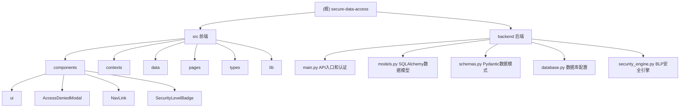

# secure-data-access 项目架构文档

## 项目愿景

secure-data-access 是一个基于强制访问控制（MAC）原理的安全数据访问系统，专注于实现安全标记访问控制系统（Security Label Access Control, SLAC）。该项目旨在通过实施严格的安全级别标记机制来保护不同敏感度级别的数据资源，并提供完整的审计追踪功能。其核心目标是：验证主体（用户）的安全标记与客体（数据）的安全标记是否匹配，从而实现对数据的强制访问控制。

## 架构总览

这是一个全栈安全数据访问系统，采用前后端分离架构：

**前端技术栈：**
- React 18 + TypeScript + Vite + Tailwind CSS
- shadcn/ui + Radix UI 组件库
- React Router v6 路由管理
- React Query (@tanstack/react-query) 数据获取
- Axios HTTP 客户端

**后端技术栈：**
- FastAPI + Python 3.11
- SQLAlchemy ORM + MySQL 数据库
- Pydantic 数据验证
- JWT (JSON Web Tokens) 身份验证
- Uvicorn ASGI 服务器

架构遵循分层设计原则：
- **前端 UI 层**：基于 shadcn/ui 的响应式用户界面
- **前端应用层**：React 组件、路由、状态管理（AuthContext）
- **前端服务层**：API 客户端（Axios）和请求拦截
- **后端 API 层**：FastAPI RESTful API 接口
- **后端业务层**：安全引擎、访问控制逻辑
- **数据层**：MySQL 数据库 + SQLAlchemy ORM

## 模块结构图



## 模块索引

### 前端模块
| 模块路径 | 职责描述 |
|---------|----------|
| src/contexts | 认证上下文管理，处理用户登录状态、JWT Token管理和权限验证 |
| src/pages | 主要页面组件（登录、管理员仪表盘、用户工作台） |
| src/components | 通用UI组件（shadcn/ui）和安全相关组件（SecurityLevelBadge, AccessDeniedModal） |
| src/types | 安全标记相关的类型定义和核心访问控制逻辑（canAccess函数） |
| src/data | Mock 数据定义（用户、数据记录、安全规则、审计日志） |
| src/lib | 工具函数（utils.ts）和API客户端（api.ts with Axios） |

### 后端模块
| 模块路径 | 职责描述 |
|---------|----------|
| backend/main.py | FastAPI 应用入口，JWT认证实现，RESTful API路由定义 |
| backend/models.py | SQLAlchemy ORM数据模型（User, SecurityLevel, Salary, Notice, AccessPolicy, AccessDecision） |
| backend/schemas.py | Pydantic数据验证模式（SecurityLevelBase, UserResponse, Token等） |
| backend/database.py | MySQL数据库连接配置和会话管理 |
| backend/security_engine.py | 基于BLP模型的强制访问控制引擎（verify_access函数） |

## 运行与开发

### 环境要求
- Node.js 18+
- Python 3.11+
- MySQL 8.0+

### 后端启动
```bash
# 进入后端目录
cd backend

# 创建虚拟环境（首次）
python -m venv venv

# 激活虚拟环境
venv\Scripts\activate

# 安装依赖（注意：需要安装python-jose[cryptography]用于JWT）
pip install fastapi uvicorn sqlalchemy pymysql pydantic python-jose[cryptography]

# 启动后端服务（端口8002）
python main.py
# 服务地址：http://127.0.0.1:8002
```

### 前端启动
```bash
# 安装依赖
npm install

# 启动开发服务器
npm run dev
# 服务地址：http://localhost:5173
```

### 构建
```bash
# 构建生产版本
npm run build
```

### 代码检查
```bash
# 代码检查
npm run lint
```

### 预览构建结果
```bash
npm run preview
```

## 编码规范

- 代码风格：遵循 ESLint 规范
- TypeScript：严格类型检查
- 组件命名：采用 PascalCase
- 样式命名：使用 Tailwind CSS 实用优先方法
- 文件组织：按功能模块划分目录结构

## AI 使用指引

### 数据库设计

完整的数据库表结构包括：

#### 1. 安全等级表（sys_security_level）
- `level_id`：等级 ID（主键）
- `level_name`：等级名称（如"公开 (Public)"、"内部 (Internal)"等）
- `level_weight`：权重值（用于比较等级高低，数值越大权限越高）
- `description`：等级描述

#### 2. 职能类别表（sys_category）
- `category_id`：类别ID（主键）
- `category_code`：类别编码
- `category_name`：类别名称
- `description`：职能描述

#### 3. 用户表（sys_user）
- `user_id`：用户ID（主键）
- `username`：登录账号
- `password_hash`：密码哈希（注意：当前实现使用明文密码）
- `real_name`：真实姓名
- `security_level_id`：安全等级外键
- `category_id`：职能类别外键
- `trust_level`：信任等级（USER/ADMIN）
- `created_at`：创建时间

#### 4. 薪资数据表（data_salary）
- `data_id`：数据ID（主键）
- `employee_name`：员工姓名
- `base_salary`：基本工资
- `bonus`：奖金
- `data_security_level_id`：数据安全等级外键
- `data_category_id`：数据类别外键
- `lifecycle_status`：生命周期状态（ACTIVE/ARCHIVED）

#### 5. 公司公告表（data_notice）
- `notice_id`：公告ID（主键）
- `title`：标题
- `content`：内容
- `data_security_level_id`：数据安全等级外键
- `data_category_id`：数据类别外键

#### 6. 访问策略记录表（sys_access_policy）
- `policy_id`：策略ID（主键）
- `subject_user_id`：主体用户ID
- `object_data_id`：客体数据ID
- `target_table`：目标表名
- `subject_level_snapshot`：主体安全等级快照
- `object_level_snapshot`：客体安全等级快照
- `operation_requested`：请求操作（READ/WRITE）
- `request_time`：请求时间

#### 7. 访问决策结果表（sys_access_decision）
- `decision_id`：决策ID（主键，与policy_id 1:1对应）
- `result_code`：决策结果（ALLOW/DENY）
- `result_message`：决策说明/拒绝原因
- `decision_time`：决策时间
- `policy_id`：策略ID外键

## API 接口

### 1. 获取访问令牌（认证）
- **接口**：`POST /token`
- **功能**：用户登录认证，返回JWT访问令牌
- **请求格式**：FormData (username, password)
- **返回格式**：`{ "access_token": "jwt_token", "token_type": "bearer" }`

### 2. 获取当前用户信息
- **接口**：`GET /users/me`
- **功能**：获取当前认证用户的信息
- **认证**：需要Bearer Token
- **返回格式**：UserResponse对象，包含用户ID、用户名、角色、安全等级等信息

### 3. 获取安全等级列表
- **接口**：`GET /security-levels`
- **功能**：返回所有安全等级信息
- **返回格式**：JSON数组，包含等级ID、名称、权重和描述
- **响应模型**：SecurityLevelBase[]

## 核心安全逻辑

### 安全等级体系
- **等级顺序**：public (1) < internal (2) < secret (3) < confidential (4)
- **注意**：前端types/security.ts中定义的优先级与后端models.py中的level_weight对应
- **访问规则**：主体安全等级 ≥ 客体安全等级 时允许访问（下读原则）

### 前端安全实现
- **核心函数**：`canAccess(subjectLevel, objectLevel)` - 在src/types/security.ts中实现
- **安全等级映射**：`mapSecurityLevelNameToKey()` - 处理后端中文名称到前端英文键的转换
- **关键组件**：
  - `SecurityLevelBadge`：显示安全等级标记的徽章组件，支持不同尺寸和图标
  - `AccessDeniedModal`：当访问被拒绝时显示的模态框（当前未在代码中找到具体实现）
  - `AuthContext`：管理JWT Token、用户认证状态和权限验证

### 后端安全实现
- **核心函数**：`verify_access(user, resource, action="read")` - 在backend/security_engine.py中实现
- **BLP模型**：基于Bell-LaPadula模型的简化实现，仅支持"下读(Read Down)"策略
- **安全快照**：访问策略表(sys_access_policy)保存访问时的安全等级快照，确保审计可追溯

### 完整数据模型
- **User**：用户实体，包含安全等级标记和信任等级
- **SecurityLevel**：安全等级定义，包含权重值用于比较
- **Category**：职能类别，用于进一步细分访问控制
- **Salary/Notice**：具体的数据资源，包含客体安全标记
- **AccessPolicy/AccessDecision**：完整的审计追踪模型，记录所有访问请求和决策结果

### 当前限制与扩展建议
#### 已识别的限制：
1. **密码安全**：后端使用明文密码存储（verify_password直接比较明文）
2. **JWT密钥**：SECRET_KEY硬编码在main.py中，生产环境应从环境变量读取
3. **写操作**：security_engine.py中的verify_access函数不支持写操作（上写原则）
4. **前端Mock**：前端使用mock数据，需要连接真实后端API

#### 扩展建议：
1. **密码哈希**：实现密码哈希存储（bcrypt等）
2. **环境变量**：将敏感配置移至环境变量
3. **完整BLP**：实现上写(Write Up)策略
4. **真实API集成**：替换前端mock数据为真实API调用
5. **数据资源管理**：添加CRUD接口管理Salary和Notice数据
6. **审计查询**：实现审计日志查询API
7. **数据加密**：对敏感数据进行加密存储
8. **细粒度权限**：基于职能类别(Category)实现更细粒度的访问控制

## 变更记录 (Changelog)

### 2025-12-30
- **完整代码分析**：全面读取并分析前后端所有核心文件
- **架构文档更新**：基于实际代码实现更新技术栈和模块描述
- **数据库模型完善**：详细记录7个数据库表的完整结构
- **API接口文档化**：记录3个核心API接口的详细信息
- **安全逻辑澄清**：明确前后端安全等级体系和访问控制实现
- **问题识别**：识别密码明文存储、JWT密钥硬编码等安全问题
- **扩展建议**：提供8项具体的系统改进和扩展建议
- **端口修正**：修正后端服务端口为8002（根据main.py配置）
- **账户信息更新**：根据前端Login.tsx更新演示账户信息
